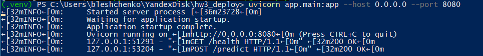
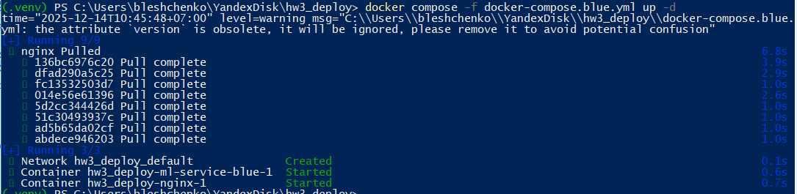
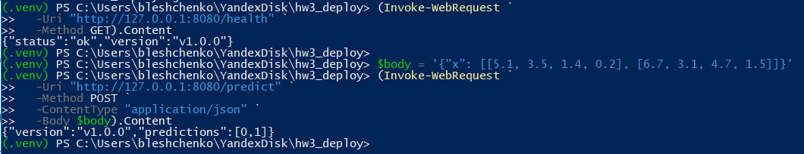
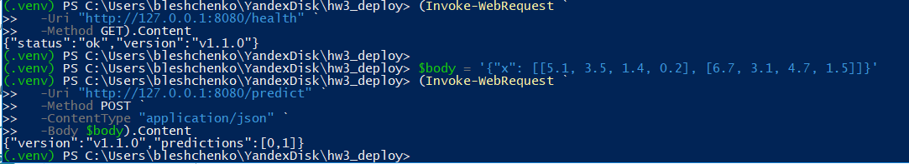

# ml-сервис для демо blue-green деплоя

Проект представляет собой простой ml-сервис для работы с датасетом iris.  
Сервис предоставляет два эндпоинта: `/health` для проверки статуса и версии модели и `/predict` для получения предсказаний.  
В проекте реализована стратегия развертывания **Blue-Green** и настроен базовый CI/CD через **GitHub Actions**.

---

## Локальный запуск без docker

### Подготовка окружения
python -m venv .venv
.venv\Scripts\activate
pip install -r requirements.txt

### Запуск сервиса
uvicorn app.main:app --host 0.0.0.0 --port 8080

Проверка эндпоинтов:

- `GET http://localhost:8080/health`  
- `POST http://localhost:8080/predict` 

Ожидаемый результат:

---

## Запуск в docker (одна версия)

### Сборка и запуск образа
docker build -t ml-service:v1.0.0 .
docker run -p 8080:8080 ml-service:v1.0.0

Проверка эндпоинтов:

- `GET http://localhost:8080/health`  
- `POST http://localhost:8080/predict` 

Ожидаемый результат:

---

## Blue-Green развертывание

Для демонстрации стратегии Blue-Green используются два docker-compose файла и nginx как простой балансировщик.

### Blue: старая версия модели (v1.0.0)

Запуск:

docker compose -f docker-compose.blue.yml up -d

Ожидаемый результат:

Проверка через nginx (порт 8080):

- `GET http://localhost:8080/health` -> версия `v1.0.0`.
- `POST http://localhost:8080/predict` -> предсказания от модели v1.0.0.

Пример результата:

Остановка:
docker compose -f docker-compose.blue.yml down

### Green: новая версия модели (v1.1.0)

Запуск:
docker compose -f docker-compose.green.yml up -d

Проверка:

- `GET http://localhost:8080/health` -> версия `v1.1.0`.
- `POST http://localhost:8080/predict` -> предсказания от модели v1.1.0.

Пример результата:

Остановка:
docker compose -f docker-compose.green.yml down

### Откат (rollback)

Откат к предыдущей версии реализуется через переключение compose-файла:

1. Останавливаем текущую green-версию:
docker compose -f docker-compose.green.yml down

2. Поднимаем снова blue:
docker compose -f docker-compose.blue.yml up -d
После этого `/health` снова возвращает `v1.0.0`.

---

## CI/CD на GitHub Actions

Для автоматизации сборки и деплоя используется workflow `.github/workflows/deploy.yml`.

Workflow срабатывает при push в ветку `main` и выполняет следующие шаги:

1. Клонирует репозиторий.
2. Собирает docker-образ сервиса.
3. Имитация отправки образа в контейнерный реестр (учебный пример).
4. Вызывает API деплоя с использованием секретов GitHub.
5. Выполняет проверку `/health` после деплоя.

Используемые секреты:

- `CLOUD_TOKEN` — токен для вызова API деплоя (в примере используется тестовое значение).  
- `MODEL_VERSION` — версия модели, которая передаётся в запрос деплоя.  
- Встроенный `GITHUB_TOKEN` используется для аутентификации при работе с реестром.

---

## Мониторинг и логи

Базовый мониторинг реализован через эндпоинт `/health`, который возвращает статус сервиса и текущую версию модели. Эндпоинт `/predict` можно использовать для проверки корректности инференса на примерах.

Логи запросов и ошибок пишет сервер `uvicorn`/контейнеры docker, их можно посмотреть командами:
docker logs ml-service-blue
docker logs ml-service-green 
